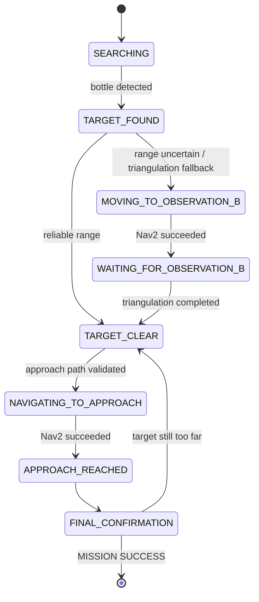

[README_detailed.md](https://github.com/user-attachments/files/32037968/README_detailed.md)
# Semantic Robot

> 基于 **ROS 2 Jazzy + Gazebo Harmonic + Nav2 + OpenCV** 的移动机器人语义目标搜索、定位与自主接近系统

本项目在 Gazebo 仿真环境中构建了一套完整的移动机器人自主任务链路：机器人首先在环境中主动搜索目标，通过 RGB Camera 检测红色 bottle，结合 2D LiDAR 获取目标距离；当 LiDAR 距离可信时直接完成 Camera-LiDAR 目标定位，当距离不可靠时自动切换到双视点主动感知与三角定位；随后基于 Nav2 global costmap 生成安全 approach pose，使用 `ComputePathToPose` 进行路径可达性验证，再通过 `NavigateToPose` 执行导航，并在到达后重新感知目标、多轮迭代逼近，直到满足最终距离与视觉确认条件。

项目重点不是单独实现某一个算法，而是把 **机器人模型、TF、多传感器融合、SLAM、定位、导航、视觉感知、主动感知、目标定位、安全规划与闭环任务状态机** 串成一条完整可运行链路。

---

# 1. Demo Result

当前完整任务已经在 Gazebo 环境中跑通。

一次成功测试的最终日志：

```text
[MISSION SUCCESS]
    target reached and visually confirmed
    final_distance=0.75 m
    final_angle=8.21 deg
    range_uncertain=True
    approach_iterations=3
```

对应完整行为：

```text
启动系统
    ↓
SEARCHING 主动原地旋转
    ↓
Camera 扫描到红色 bottle
    ↓
停止旋转
    ↓
Camera + LiDAR 估计目标位置
    ↓
生成安全 approach candidates
    ↓
Global Costmap 安全过滤
    ↓
ComputePathToPose 路径验证
    ↓
NavigateToPose
    ↓
停车后重新获取 fresh detection
    ↓
如果仍然太远：重新定位 + 重新规划
    ↓
多轮迭代逼近
    ↓
最终视觉确认
    ↓
MISSION SUCCESS
```

---

# 2. Technology Stack

| Layer | Technology |
|---|---|
| OS | Ubuntu 24.04 |
| Middleware | ROS 2 Jazzy |
| Simulator | Gazebo Harmonic |
| Visualization | RViz2 |
| Robot Model | URDF / Xacro |
| Coordinate System | TF2 |
| Motion | Differential Drive |
| LiDAR | Gazebo GPU LiDAR |
| Camera | Gazebo RGB Camera |
| IMU | Gazebo IMU |
| Localization Fusion | `robot_localization` EKF |
| Mapping | SLAM Toolbox |
| Global Localization | AMCL |
| Navigation | Nav2 |
| Global Planner | Navfn Planner |
| Local Controller | Regulated Pure Pursuit |
| Task Navigation | NavigateToPose |
| Path Validation | ComputePathToPose |
| Vision | OpenCV + HSV segmentation |
| Sensor Fusion | Camera bearing + LaserScan |
| Language | Python |
| ROS-Gazebo Communication | `ros_gz_bridge` |

开发环境目前主要运行于 VMware Ubuntu，因此 Nav2 与 Gazebo 参数中包含针对虚拟机算力和时序抖动的适配。

---

# 3. Repository Structure

```text
semantic-robot/
├── .gitignore
│
└── src/
    ├── robot_control/
    │   ├── package.xml
    │   ├── setup.py
    │   ├── setup.cfg
    │   │
    │   └── robot_control/
    │       ├── bottle_detector.py
    │       ├── semantic_search_controller.py
    │       ├── slam_explorer.py
    │       ├── waypoint_follower.py
    │       ├── navigate_to_pose_simple.py
    │       ├── go_to_goal.py
    │       ├── go_to_goal_p.py
    │       ├── move_distance.py
    │       ├── rotate_angle.py
    │       ├── square_motion.py
    │       ├── scan_frame_republisher.py
    │       └── odom_tf_broadcaster.py
    │
    └── robot_description/
        ├── CMakeLists.txt
        ├── package.xml
        │
        ├── config/
        │   ├── ekf.yaml
        │   ├── nav2_params.yaml
        │   └── navigate_to_pose_reduced_replanning.xml
        │
        ├── launch/
        │   ├── display.launch.py
        │   ├── simulation.launch.py
        │   └── nav2.launch.py
        │
        ├── maps/
        │   ├── semantic_map.pgm
        │   ├── semantic_map.yaml
        │   ├── simple_map.pgm
        │   └── simple_map.yaml
        │
        ├── urdf/
        │   ├── robot.urdf.xacro
        │   ├── robot_core.xacro
        │   └── gazebo.xacro
        │
        └── worlds/
            └── empty.sdf
```

---

# 4. Package Design

## 4.1 `robot_description`

负责：

- Robot URDF / Xacro
- Gazebo physics
- DiffDrive plugin
- LiDAR / Camera / IMU sensor
- Gazebo world
- TF related launch
- Nav2 configuration
- EKF configuration
- Static map

## 4.2 `robot_control`

负责：

- 基础运动控制实验
- Odom-based point control
- Waypoint tracking
- SLAM 建图辅助运动
- Scan frame 修正
- OpenCV bottle detection
- Semantic search state machine
- Camera-LiDAR target localization
- Active triangulation
- Safe approach planning
- Nav2 action 调用
- Final mission confirmation

---

# 5. Robot Model

机器人采用差速移动底盘。

## 5.1 Chassis

主要尺寸：

```text
base_length = 0.50 m
base_width  = 0.35 m
base_height = 0.15 m
```

`base_footprint -> base_link`：

```text
z = 0.125 m
```

主底盘质量：

```text
8.0 kg
```

主底盘惯性中心经过物理稳定性修正：

```xml
<origin xyz="-0.05 0 0" rpy="0 0 0"/>
```

即质心沿机器人 X 轴向后移动 5 cm。

---

## 5.2 Drive Wheels

```text
wheel_radius = 0.10 m
wheel_width  = 0.04 m
wheel_y      = ±0.195 m
```

Gazebo DiffDrive 使用：

```text
wheel_separation = 0.39 m
wheel_radius     = 0.10 m
```

左右轮 joint：

```text
left_wheel_joint
right_wheel_joint
```

---

## 5.3 Caster

后部使用球形 caster：

```text
radius = 0.05 m
position x = -0.18 m
position z = -0.075 m
```

Gazebo 中对 caster 设置较低摩擦：

```text
mu1 = 0.01
mu2 = 0.01
```

降低万向轮对差速转向的干扰。

---

# 6. Sensor Configuration

## 6.1 LiDAR

LiDAR 安装在：

```text
base_link -> laser_link
xyz = (0.50, 0.00, 0.12)
```

Gazebo GPU LiDAR 参数：

```text
update_rate = 10 Hz
horizontal samples = 360
horizontal FOV = -π ~ +π
vertical samples = 1
range_min = 0.10 m
range_max = 10.0 m
range_resolution = 0.01 m
```

这是一个二维水平扫描 LiDAR。

---

## 6.2 Camera

Camera 安装在：

```text
base_link -> camera_link
xyz = (0.30, 0.00, 0.22)
```

参数：

```text
resolution = 640 x 480
horizontal_fov = 1.047 rad
update_rate = 30 Hz
near clip = 0.1 m
far clip = 20.0 m
```

在 VMware 环境中，实际 Camera 数据频率可能低于 Gazebo 配置频率，因此状态机中对视觉 timeout 和 fresh detection 做了额外保护。

---

## 6.3 IMU

IMU：

```text
base_link -> imu_link
xyz = (0.00, 0.00, 0.10)
```

Gazebo IMU：

```text
update_rate = 100 Hz
topic = /imu
```

Gazebo 发布的 IMU frame 为：

```text
semantic_robot/imu_link/imu_sensor
```

而 URDF 中实际存在的是：

```text
imu_link
```

因此 `simulation.launch.py` 中补充了一条零位姿 static TF：

```text
imu_link
    ↓
semantic_robot/imu_link/imu_sensor
```

保证 `robot_localization` 能够正确 transform IMU message。

---

# 7. Gazebo Simulation Architecture

`simulation.launch.py` 当前启动：

```text
robot_state_publisher
Gazebo Harmonic
semantic_robot spawn
ros_gz_bridge
scan_frame_republisher
IMU sensor static TF
```

Gazebo 内部 DiffDrive plugin：

```text
/cmd_vel
    ↓
Differential Drive
    ↓
/odom
```

odom 发布频率：

```text
50 Hz
```

DiffDrive 本身不再发布：

```text
odom -> base_footprint
```

TF，因为该 TF 已交由 EKF 发布，避免 TF 双发布冲突。

---

# 8. LaserScan Bridge Design

Gazebo LiDAR 数据首先通过 `ros_gz_bridge` 转为 ROS LaserScan。

为了修正 frame_id，系统采用：

```text
Gazebo /scan
    ↓
ros_gz_bridge
    ↓
/scan_raw
    ↓
scan_frame_republisher
    ↓
frame_id = laser_link
    ↓
/scan
```

`scan_frame_republisher.py` 使用 `qos_profile_sensor_data` 订阅和发布 LaserScan。

这一点非常重要：临时 Python 节点订阅 `/scan` 时，也应该使用 sensor-data QoS，否则可能出现：

```text
incompatible QoS
Last incompatible policy: RELIABILITY
```

---

# 9. TF Architecture

当前 TF 权责：

```text
map
 ↓
odom
 ↓
base_footprint
 ↓
base_link
 ├── laser_link
 ├── camera_link
 ├── imu_link
 ├── left_wheel_link
 ├── right_wheel_link
 └── caster_link
```

其中：

```text
map -> odom
```

由 AMCL 发布。

```text
odom -> base_footprint
```

由 `robot_localization` EKF 发布。

URDF / Robot State Publisher 负责：

```text
base_footprint -> base_link -> sensors / wheels
```

该设计避免多个节点同时发布同一 TF。

---

# 10. EKF Sensor Fusion

配置文件：

```text
src/robot_description/config/ekf.yaml
```

使用：

```text
robot_localization / ekf_filter_node
```

核心：

```yaml
frequency: 30.0
two_d_mode: true
publish_tf: true
world_frame: odom
```

Wheel odometry：

```text
/odom
```

主要提供：

```text
x
y
vx
```

IMU：

```text
/imu
```

主要提供：

```text
yaw
yaw_rate
```

这样避免直接使用原始 wheel odom yaw，而由 IMU 修正航向。

最终输出：

```text
odom -> base_footprint
```

---

# 11. Mapping

项目使用 SLAM Toolbox 构建二维 occupancy map。

当前语义任务使用：

```text
src/robot_description/maps/semantic_map.yaml
```

地图参数：

```text
resolution = 0.05 m/cell
origin = [-0.548, -0.535, 0]
mode = trinary
occupied_thresh = 0.65
free_thresh = 0.196
```

---

# 12. SLAM Helper: `slam_explorer.py`

仓库中包含一个专门用于建图阶段的辅助巡航节点：

```text
slam_explorer
```

它并不是 frontier exploration，也不使用 Nav2，而是通过 `/odom` 反馈和 `/cmd_vel` 控制机器人按预设安全路线运动。

路线由：

```text
FORWARD
→ TURN
→ FORWARD
→ TURN
...
→ DONE
```

组成。

前进距离：

```text
[0.9, 0.6, 2.3, 2.9, 2.3, 2.9] m
```

转向：

```text
左 90°
右 90°
左 90°
左 90°
左 90°
```

运动速度：

```text
linear_speed  = 0.12 m/s
angular_speed = 0.25 rad/s
```

每一段都根据 odom 相对位姿计算完成条件，而不是依赖固定时间，因此误差不会简单跨段累积。

---

# 13. Gazebo Test World

文件：

```text
src/robot_description/worlds/empty.sdf
```

尽管文件名叫 `empty.sdf`，当前版本实际已经是语义导航测试环境。

房间内部约：

```text
6 m x 6 m
x ∈ [-0.5, 5.5]
y ∈ [-0.5, 5.5]
```

包含：

| Object | Position / Size |
|---|---|
| South Wall | y ≈ -0.55 |
| North Wall | y ≈ 5.55 |
| West Wall | x ≈ -0.55 |
| East Wall | x ≈ 5.55 |
| box_obstacle_1 | center `(2.0, 1.8)`, size `0.8 x 0.8 x 1.0` |
| box_obstacle_2 | center `(4.3, 3.8)`, size `0.6 x 1.2 x 1.0` |
| pillar | center `(2.2, 4.5)`, size `0.4 x 0.4 x 1.2` |
| low_table | center `(4.8, 1.5)`, size `0.8 x 0.6 x 0.6` |
| bottle_1 | red, `(4.8, 1.5, 0.725)` |
| bottle_2 | blue, `(4.8, 4.8, 0.125)` |

当前语义感知任务针对：

```text
bottle_1
```

即低台上的红色 bottle。

`bottle_2` 目前作为环境中的另一个语义物体存在，但当前 detector 并不会检测蓝色目标。

---

# 14. Nav2 Stack

`nav2.launch.py` 启动：

```text
map_server
amcl
planner_server
controller_server
behavior_server
bt_navigator
lifecycle_manager
```

Lifecycle Manager 延迟 2 秒启动，减少节点刚启动阶段的时序问题。

---

# 15. AMCL

AMCL 配置：

```text
global_frame_id = map
odom_frame_id = odom
base_frame_id = base_footprint

scan_topic = /scan
laser_model_type = likelihood_field
```

粒子数：

```text
min_particles = 500
max_particles = 2000
```

更新阈值：

```text
update_min_d = 0.10 m
update_min_a = 0.10 rad
```

仿真初始位姿：

```text
x = 0
y = 0
yaw = 0
```

---

# 16. Global Planner

Nav2 global planner：

```text
nav2_navfn_planner::NavfnPlanner
```

配置：

```text
planner_id = GridBased
tolerance = 0.5
use_astar = false
allow_unknown = true
expected_planner_frequency = 1 Hz
```

---

# 17. Global Costmap

Global Costmap：

```text
global_frame = map
robot_base_frame = base_footprint
resolution = 0.05 m
update_frequency = 5 Hz
publish_frequency = 2 Hz
```

插件：

```text
StaticLayer
InflationLayer
```

Inflation：

```text
inflation_radius = 0.45 m
cost_scaling_factor = 2.5
```

Global footprint：

```text
[
 [ 0.25,  0.175],
 [ 0.25, -0.175],
 [-0.25, -0.175],
 [-0.25,  0.175]
]
```

---

# 18. Local Costmap

Local Costmap：

```text
global_frame = odom
rolling_window = true
width = 6 m
height = 6 m
resolution = 0.05 m
update_frequency = 10 Hz
publish_frequency = 5 Hz
```

插件：

```text
ObstacleLayer
InflationLayer
```

Obstacle source：

```text
/scan
```

激光参数：

```text
obstacle_min_range = 0.1 m
obstacle_max_range = 8.0 m
raytrace_min_range = 0.1 m
raytrace_max_range = 10.0 m
```

Local footprint：

```text
[
 [ 0.27,  0.23],
 [ 0.27, -0.23],
 [-0.27, -0.23],
 [-0.27,  0.23]
]
```

---

# 19. Local Controller

Local controller 使用：

```text
nav2_regulated_pure_pursuit_controller
```

核心参数：

```text
desired_linear_vel = 0.22 m/s

lookahead_dist = 0.30 m
min_lookahead_dist = 0.15 m
max_lookahead_dist = 0.45 m

rotate_to_heading_angular_vel = 0.5 rad/s
rotate_to_heading_min_angle = 0.5 rad

min_approach_linear_velocity = 0.05 m/s
approach_velocity_scaling_dist = 0.4 m

use_collision_detection = true
allow_reversing = false
```

Goal checker：

```text
xy_goal_tolerance = 0.10 m
yaw_goal_tolerance = 0.10 rad
```

---

# 20. VMware-specific Nav2 Adaptation

在 VMware 中，Gazebo、RViz、Camera、Nav2 同时运行时容易产生计算延迟。

项目针对该环境进行了多项适配。

Controller frequency：

```text
10 Hz → 5 Hz
```

RPP transform tolerance：

```text
0.3 s
```

BT Navigator：

```text
bt_loop_duration = 200 ms
default_server_timeout = 1000 ms
wait_for_service_timeout = 2000 ms
```

自定义 Behavior Tree：

```text
navigate_to_pose_reduced_replanning.xml
```

把全局路径重新规划频率从默认较高频率降为：

```text
0.2 Hz
```

即：

```text
每 5 秒重新规划一次
```

减少虚拟机高 CPU load 下 `ComputePathToPose` action timeout。

Recovery sequence 包括：

```text
Clear Local Costmap
Clear Global Costmap
Spin
Wait
BackUp
```

---

# 21. Vision: `bottle_detector.py`

目标检测节点：

```text
ros2 run robot_control bottle_detector
```

输入：

```text
/camera
/camera_info
/scan
```

输出：

```text
/bottle_detection/angle
/bottle_detection/distance
/bottle_detection/occluded
/bottle_detection/range_uncertain
/bottle_detection/image
```

---

# 22. Red Bottle Detection

检测流程：

```text
ROS Image
    ↓
cv_bridge
    ↓
BGR Image
    ↓
HSV
    ↓
Red Mask 1 + Red Mask 2
    ↓
Morphological Open
    ↓
Morphological Close
    ↓
Contour Detection
    ↓
Area Filter
    ↓
Largest Valid Contour
```

HSV 红色双区间：

```text
H = 0 ~ 10
H = 170 ~ 180
```

S/V 下限：

```text
S >= 120
V >= 70
```

最小 contour area：

```text
100 px
```

检测结果包含：

```text
bounding box
center_u
center_v
contour area
camera horizontal angle
```

---

# 23. Camera Bearing

CameraInfo 提供：

```text
fx
cx
```

像素中心到 Camera 水平角：

```text
angle_rad = atan2(center_u - cx, fx)
```

符号：

```text
Camera angle < 0 : target left
Camera angle > 0 : target right
```

---

# 24. Camera-LiDAR Fusion

ROS LaserScan 的角度符号与图像方向约定不同：

```text
ROS LaserScan:
positive angle = left

Camera image:
positive angle = right
```

因此：

```text
lidar_angle = -camera_angle
```

系统找到对应 LaserScan index 后，不只取一个激光点，而是使用目标方向附近：

```text
index - 2
...
index + 2
```

最多 5 个有效 range，并取：

```text
median
```

以减少单个 LiDAR sample 的噪声。

---

# 25. `range_uncertain`

当前代码中：

```text
bottle_distance < 1.0 m
```

会被标记：

```text
range_uncertain = True
```

这一变量的语义不是：

```text
“Camera 一定被遮挡”
```

而是：

```text
“Camera bearing 对应的 LiDAR return 可能来自近处前景，
不能保证这个 range 就是 bottle 本身。”
```

因此主状态机不会简单把 `range_uncertain=True` 当作视觉遮挡。

需要注意：当前 `occluded` 和 `range_uncertain` 在 detector 中使用相同的数值判定，但在控制器中的语义已经被区分。后续版本可进一步拆分这两个概念。

---

# 26. Semantic Search Controller

核心文件：

```text
semantic_search_controller.py
```

该文件是项目的任务级控制中枢。

它负责：

```text
主动搜索
目标检测状态管理
TF 查询
Camera-LiDAR 定位
主动双视点定位
costmap candidate evaluation
ComputePathToPose validation
NavigateToPose
approach iteration
final confirmation
mission result
```

---

# 27. State Machine

主要状态：

```text
SEARCHING
TARGET_FOUND
REPOSITION_REQUIRED
TARGET_CLEAR
MOVING_TO_OBSERVATION
MOVING_TO_OBSERVATION_B
WAITING_FOR_OBSERVATION_B
NAVIGATING_TO_APPROACH
APPROACH_REACHED
FINAL_CONFIRMATION
```

任务主路径：



实际代码中还包含早期 observation/reposition 相关逻辑，当前最终语义主流程主要使用 Direct Localization 与 Active Triangulation 两条定位路径。

---

# 28. Active Search

当系统处于：

```text
SEARCHING
```

且没有 Nav2 goal 在执行时：

```text
linear.x = 0
angular.z = 0.30 rad/s
```

状态机每：

```text
0.2 s
```

刷新一次 `/cmd_vel`。

搜索最长：

```text
30 s
```

开始搜索日志：

```text
[SEARCH]
    active rotation started
    angular_speed=0.30 rad/s
    timeout=30.0 s
```

发现 bottle 后：

```text
stop_search_motion()
```

先发布零 Twist，再：

```text
SEARCHING -> TARGET_FOUND
```

避免上一帧角速度残留。

---

# 29. Direct Target Localization

这是当前目标定位的 PRIMARY 路径。

触发条件：

```text
Camera angle valid
LiDAR distance valid
range_uncertain == False
```

系统查询：

```text
map -> camera_link
```

得到：

```text
camera_x
camera_y
camera_yaw
```

由于：

```text
Camera image:
positive = right

ROS yaw:
positive = left
```

目标绝对 bearing：

```text
target_map_bearing
=
camera_yaw - camera_angle
```

再计算：

```text
target_x
=
camera_x + range * cos(target_bearing)

target_y
=
camera_y + range * sin(target_bearing)
```

结果存入：

```text
target_map_position
```

定位 source：

```text
camera_lidar_direct
```

---

# 30. Active Triangulation Fallback

当：

```text
range_uncertain == True
```

时，系统不会强行使用可能错误的 LiDAR range。

而是执行：

```text
Observation A
→ Observation B
→ Ray Intersection
```

---

# 31. Observation A

Observation A：

```text
TARGET_FOUND
+
range_uncertain == True
```

触发。

系统不是使用单帧 Camera angle，而是收集：

```text
5 frames
```

然后取：

```text
median angle
```

同时记录：

```text
robot pose
camera pose
camera bearing
```

视觉射线 origin 使用：

```text
camera_link
```

而不是：

```text
base_footprint
```

---

# 32. Observation B Viewpoint Planning

Observation A 记录后，系统规划第二观察视点。

当前 baseline candidates：

```text
0.5 m
0.6 m
```

Viewpoint candidate 会根据：

```text
Global Costmap
candidate region
lateral baseline
travel distance
```

筛选。

排序主要偏向：

```text
1. lower max cost
2. lower mean cost
3. larger lateral baseline
4. shorter radius
```

---

# 33. Observation B Path Validation

Observation B 并不是生成一个 candidate 后直接导航。

系统先调用：

```text
ComputePathToPose
```

检查：

```text
path exists
path pose count >= 2
all path cells exist in costmap
path cost < 80
```

只有：

```text
VIEWPOINT PATH VALID
```

才会调用：

```text
NavigateToPose
```

移动到 Observation B。

---

# 34. Why Triangulation Uses `odom`

A / B 两次 observation 之间：

```text
AMCL map -> odom
```

可能动态修正。

如果两条射线分别直接用不同时间的 `map` frame 构造，其相对几何会受 AMCL correction 影响。

因此当前实现选择：

```text
Observation A ray: odom
Observation B ray: odom
```

即：

```text
camera origin in odom
camera bearing in odom
```

在稳定的局部 odom frame 中完成短时间双视点 triangulation。

最终只把计算出的：

```text
target_odom_position
```

通过最新：

```text
map <- odom
```

转换一次得到：

```text
target_map_position
```

这种做法把短时几何定位与全局定位 correction 分离。

---

# 35. Safe Approach Planner

得到 `target_map_position` 后，Stage 5 不直接将目标点作为 Nav2 goal。

因为 bottle 可能：

```text
位于桌子上
位于障碍物旁
处于不可行驶区域
```

机器人需要停在目标附近的安全位置，而不是撞向目标坐标。

因此采用：

```text
progress-based safe approach planner
```

---

# 36. Approach Candidate Generation

当前候选 forward distance：

```text
0.8 m
1.2 m
1.6 m
2.0 m
```

角度 offset：

```text
-45°
-30°
-15°
0°
+15°
+30°
+45°
```

每个候选由当前机器人位置出发产生。

同时要求：

```text
remaining_to_target >= 1.0 m
```

避免候选点直接落到 bottle / table 附近。

候选 yaw 始终朝向目标。

---

# 37. Approach Costmap Safety

每个 approach candidate 会检查：

```text
center_cost
max_cost
mean_cost
unknown cells
out-of-bounds cells
```

并检查候选点周围一定半径区域，而不是只检查一个 map cell。

典型 reject reason：

```text
approach pose outside map
out_of_bounds cells in approach region
high center inflation cost
obstacle too close to approach footprint
```

通过后：

```text
result=SAFE
```

---

# 38. Approach Path Validation

局部安全并不等于路径可达。

因此每个 local-safe candidate 继续调用：

```text
ComputePathToPose
```

并逐个检查 path 上的 costmap cell。

当前 path cost threshold：

```text
80
```

如果某 candidate path 不合格：

```text
APPROACH PATH REJECTED
```

系统不会直接结束，而是继续尝试下一个 safe candidate。

只有：

```text
APPROACH PATH VALID
```

才正式选择 approach pose。

---

# 39. NavigateToPose

Approach path 验证通过后：

```text
PoseStamped(frame_id="map")
```

被发送到：

```text
NavigateToPose
```

并通过多重 guard 防止 5 Hz timer 重复发送相同 goal：

```text
approach_nav_started
approach_nav_active
nav_goal_active
```

Observation B navigation 和 Approach navigation 使用独立 callback，避免两个导航任务的后处理相互串扰。

---

# 40. Iterative Approach

第一次到达 approach pose 后，机器人不会直接宣布成功。

导航成功后：

```text
清空旧 detection
记录 approach_arrival_time
等待新的 Camera frame
```

状态进入：

```text
FINAL_CONFIRMATION
```

只有停车之后的新 detection 才能用于判断。

如果：

```text
distance > 1.2 m
```

且 range 仍可信：

```text
direct_target_localization()
```

会使用新的：

```text
Camera angle
LiDAR range
map -> camera_link
```

重新估计目标位置。

随后：

```text
reset Stage 5 iteration flags
→ regenerate approach candidates
→ validate new path
→ NavigateToPose again
```

最多：

```text
3 iterations
```

---

# 41. Final Confirmation

每轮 Approach Navigation 成功后：

```text
final_confirmation_timeout = 5 s
```

系统等待 fresh bottle detection。

最终成功条件：

```text
fresh detection
AND
valid distance
AND
distance <= 1.2 m
AND
abs(camera_angle) <= 15°
```

近距离阶段允许：

```text
range_uncertain = True
```

因为此时 range 不再用于下一轮目标坐标计算，而主要通过：

```text
目标仍然被 Camera 看见
+
机器人已经足够靠近
+
目标基本处于前方
```

完成任务终态确认。

---

# 42. Successful Example

一次实际任务：

```text
initial bottle distance ≈ 4.12 m
```

第一轮 approach 后：

```text
仍然较远
```

继续重新感知、重新定位和重新规划。

最终第三轮：

```text
final_distance = 0.75 m
final_angle = 8.21 deg
approach_iterations = 3
```

输出：

```text
[MISSION SUCCESS]
    target reached and visually confirmed
```

---

# 43. Standalone Control / Learning Nodes

仓库保留了项目开发过程中逐步构建的基础节点。

这些节点体现了从基础机器人运动控制逐步发展到完整 Nav2 + Semantic Task 的过程。

## `move_distance.py`

基于 odom 控制机器人前进指定距离。

## `rotate_angle.py`

基于 odom yaw 控制指定旋转角度。

## `go_to_goal.py`

基础的目标点控制。

## `go_to_goal_p.py`

P 控制：

```text
linear = Kp_linear * distance_error
angular = Kp_angular * angle_error
```

## `square_motion.py`

组合直线和旋转动作形成方形轨迹。

## `waypoint_follower.py`

包含四个固定 waypoint：

```text
(2.0, 1.0)
(3.0, 3.0)
(1.0, 4.0)
(0.0, 2.0)
```

基于 odom + P controller 依次跟踪，同时发布：

```text
/waypoint_markers
/robot_path
```

用于 RViz 可视化。

需要说明：

> 当前这个 `waypoint_follower.py` 是一个独立的基础控制实验节点，并没有接入最终 `semantic_search_controller` 的 SEARCHING 主任务链。

当前语义任务的主动搜索方式是：

```text
原地旋转扫描
```

而不是 waypoint patrol。

后续可以把现有 waypoint follower 思路升级为：

```text
Nav2 waypoint patrol
+
semantic detection interrupt
```

形成更大范围语义搜索。

## `navigate_to_pose_simple.py`

直接演示 Nav2：

```text
ComputePathToPose
→ FollowPath
```

用于理解 planner/controller action 分工。

## `odom_tf_broadcaster.py`

早期 odom TF 实验节点。

当前最终系统已经由 EKF 发布：

```text
odom -> base_footprint
```

因此最终运行时不再使用旧 broadcaster，避免 TF 双发布。

---

# 44. Build

```bash
cd ~/semantic_robot_ws

source /opt/ros/jazzy/setup.bash

colcon build --symlink-install

source ~/semantic_robot_ws/install/setup.bash
```

---

# 45. Full Runtime

当前最终版本仍采用多终端方式运行。

后续计划将这些节点整合到统一 launch。

---

## Terminal 1 — Gazebo

```bash
source /opt/ros/jazzy/setup.bash
source ~/semantic_robot_ws/install/setup.bash

export QT_QPA_PLATFORM=xcb
export LIBGL_DRI3_DISABLE=1
export LIBGL_ALWAYS_SOFTWARE=1

ros2 launch robot_description simulation.launch.py
```

启动：

```text
Gazebo
Robot State Publisher
Robot spawn
Clock bridge
cmd_vel bridge
odom bridge
joint state bridge
LiDAR bridge
scan frame republisher
IMU sensor TF
```

---

## Terminal 2 — Camera + IMU Bridge

```bash
source /opt/ros/jazzy/setup.bash
source ~/semantic_robot_ws/install/setup.bash

ros2 run ros_gz_bridge parameter_bridge \
/camera@sensor_msgs/msg/Image@gz.msgs.Image \
/camera_info@sensor_msgs/msg/CameraInfo@gz.msgs.CameraInfo \
/imu@sensor_msgs/msg/Imu@gz.msgs.IMU
```

Camera bridge 当前保持手动启动。

---

## Terminal 3 — EKF

```bash
source /opt/ros/jazzy/setup.bash
source ~/semantic_robot_ws/install/setup.bash

ros2 run robot_localization ekf_node \
--ros-args \
--params-file ~/semantic_robot_ws/src/robot_description/config/ekf.yaml
```

---

## Terminal 4 — Nav2

```bash
source /opt/ros/jazzy/setup.bash
source ~/semantic_robot_ws/install/setup.bash

ros2 launch robot_description nav2.launch.py
```

---

## Terminal 5 — Bottle Detector

```bash
source /opt/ros/jazzy/setup.bash
source ~/semantic_robot_ws/install/setup.bash

ros2 run robot_control bottle_detector
```

---

## Terminal 6 — Semantic Search Controller

```bash
source /opt/ros/jazzy/setup.bash
source ~/semantic_robot_ws/install/setup.bash

ros2 run robot_control semantic_search_controller \
--ros-args \
-p use_sim_time:=true
```

---

# 46. Optional RViz

```bash
source /opt/ros/jazzy/setup.bash
source ~/semantic_robot_ws/install/setup.bash

rviz2
```

建议显示：

```text
Map
RobotModel
TF
LaserScan
Global Costmap
Local Costmap
Path
```

视觉调试图像：

```text
/bottle_detection/image
```

可用于确认：

```text
bounding box
target center
bearing
distance
```

---

# 47. SLAM Mapping Workflow

需要重新建图时，可以使用：

```bash
ros2 launch slam_toolbox online_async_launch.py use_sim_time:=true
```

运动方式可选择：

```text
teleop_twist_keyboard
```

或者仓库自带：

```bash
ros2 run robot_control slam_explorer
```

地图保存：

```bash
ros2 run nav2_map_server map_saver_cli \
-f ~/semantic_robot_ws/src/robot_description/maps/semantic_map
```

---

# 48. Key Engineering Debugging Case

本项目中最关键的一次系统级 bug 并不是来自 Nav2 参数，而是来自机器人物理模型。

## Symptom

Gazebo 中机器人长期保持：

```text
pitch ≈ 11.78°
```

同时 LiDAR 前方出现异常：

```text
range ≈ 0.70 m
```

SLAM 地图中大量出现：

```text
fake walls
long black lines
false occupied regions
```

最终导致 Stage 5 approach planner 大量 candidate：

```text
center_cost ≈ 99 / 100
max_cost ≈ 100
```

无法找到安全 approach pose。

---

## Root Cause

机器人前部包含：

```text
LiDAR
Camera
```

而 drive wheel 支撑轴位于底盘中心附近，后方 caster 提供第三支撑点。

原始主底盘 COM 在：

```text
x = 0
```

叠加前置 LiDAR 和 Camera 后，整体质心越过了驱动轮支撑边界。

机器人因此 nose-down，直到前部底盘 collision 与地面接触。

几何计算得到的静态倾角约：

```text
11.78°
```

与 Gazebo 实际 pitch 高度一致。

---

## LiDAR Consequence

LiDAR 本应：

```text
horizontal scan
```

但整个机器人前倾后，相当于扫描平面向下倾斜。

扫描线与地面交点约：

```text
0.7 m
```

因此原先看起来像“目标前景障碍”的短距离 LiDAR return，实际主要来自：

```text
ground
```

---

## Fix

将 8 kg 主底盘 inertial COM 后移：

```xml
<origin xyz="-0.05 0 0" rpy="0 0 0"/>
```

修复后 Gazebo：

```text
pitch ≈ 0
```

LiDAR 前方：

```text
front_range ≈ 5.0 m
```

重新构建 SLAM map 后，假障碍基本消失。

Stage 5 随后从：

```text
no reachable safe progress candidate
```

恢复为：

```text
14 local-safe progress candidates
APPROACH PATH VALID
```

并最终完成：

```text
MISSION SUCCESS
```

这一问题体现了机器人系统中非常重要的一点：

```text
Physical Model
    ↓
Sensor Geometry
    ↓
Perception
    ↓
Mapping
    ↓
Localization
    ↓
Planning
```

底层物理问题可以一直传播到最高层任务规划。

---

# 49. Design Decisions

## Why not navigate directly to the bottle?

因为 bottle 可能位于：

```text
桌上
障碍物边缘
不可行驶区域
```

所以必须生成：

```text
safe standoff pose
```

而不是把物体坐标直接作为 Nav2 goal。

---

## Why validate with `ComputePathToPose` before `NavigateToPose`?

Candidate 点本身安全，并不意味着：

```text
robot -> candidate
```

之间存在安全可行路径。

因此采用两层验证：

```text
candidate local safety
+
global path safety
```

---

## Why use Camera origin instead of robot base?

视觉 bearing 射线真实起点是：

```text
camera optical center
```

而不是：

```text
base_footprint
```

因此 Direct Localization 和 Triangulation 都尽量使用 Camera TF。

---

## Why use `odom` for A/B triangulation?

短时间 A/B geometry 需要保持局部连续性。

AMCL 的：

```text
map -> odom
```

可能在两次观测之间修正。

所以：

```text
triangulation in odom
→ final result transformed once to map
```

更加稳定。

---

## Why iterative approach?

初始目标位置可能存在：

```text
Camera pixel error
LiDAR association error
AMCL error
TF timing error
```

因此不适合“一次定位，一次走到底”。

采用：

```text
move
→ observe again
→ localize again
→ plan again
```

形成 closed-loop approach，可以逐步修正误差。

---

# 50. Known Limitations

当前 v1.0 已完成任务闭环，但仍存在以下限制。

### 1. Red target only

视觉检测当前依赖 HSV 红色分割。

不具备：

```text
general object detection
multi-class recognition
semantic text command
```

能力。

---

### 2. `range_uncertain` is heuristic

当前 `range_uncertain` 与 `occluded` 使用相同阈值产生：

```text
distance < 1.0 m
```

只是语义解释不同。

后续可基于：

```text
LiDAR neighborhood consistency
object bbox geometry
depth association
3D perception
```

做更严格的 sensor association。

---

### 3. Search is local rotation

当前语义 SEARCHING 是：

```text
360°-like in-place rotation
```

并不能主动去整个地图不同房间寻找目标。

仓库已有 `waypoint_follower.py` 基础，可以进一步扩展为：

```text
Nav2 waypoint patrol
+
detection interrupt
+
semantic mission resume
```

---

### 4. Camera-LiDAR fusion is 2D

当前利用：

```text
horizontal camera bearing
+
2D LaserScan
```

没有使用：

```text
depth camera
point cloud
full 3D object pose
```

---

### 5. Monolithic controller

`semantic_search_controller.py` 当前集中了：

```text
state machine
perception buffer
TF utility
viewpoint planning
triangulation
costmap evaluation
Nav2 clients
approach planning
mission logic
```

功能已跑通，但工程上后续适合拆分。

---

### 6. Multi-terminal startup

当前完整系统仍需要多个终端。

后续应整合：

```text
simulation
bridge
EKF
Nav2
detector
semantic controller
```

到一个统一 launch。

---

### 7. Package metadata

`robot_control/package.xml` 与 `setup.py` 中仍存在：

```text
TODO description
TODO license
placeholder maintainer email
```

正式发布前需要整理。

---

# 51. Recommended Refactor

功能冻结后建议将 `semantic_search_controller.py` 拆分成：

```text
semantic_search_controller.py
    └── mission orchestration

perception_buffer.py
    └── angle / distance / freshness

tf_utils.py
    └── map / odom / camera TF

target_localizer.py
    ├── Camera-LiDAR direct localization
    └── triangulation

viewpoint_planner.py
    └── Observation B candidate generation

costmap_utils.py
    └── cost / region / path evaluation

nav2_client.py
    ├── ComputePathToPose
    └── NavigateToPose

approach_planner.py
    └── iterative safe approach
```

优先原则：

> 当前运行版本先冻结并保留 tag，重构在新 branch 上进行，避免破坏已跑通主链。

---

# 52. Future Work

后续功能可按优先级继续扩展。

### Engineering

- [ ] One-command launch
- [ ] Controller modularization
- [ ] Parameters moved to YAML
- [ ] Better package metadata
- [ ] Automated smoke test
- [ ] Structured logging

### Search

- [ ] Nav2 waypoint patrol
- [ ] Large-area semantic search
- [ ] Search interruption when target detected
- [ ] Resume patrol after target loss

### Perception

- [ ] YOLO / learned object detector
- [ ] Multi-class target detection
- [ ] Depth Camera
- [ ] PointCloud2
- [ ] Better Camera-LiDAR association
- [ ] Target confidence estimation

### Navigation

- [ ] Dynamic obstacles
- [ ] More complex worlds
- [ ] Benchmark approach success rate
- [ ] Localization error evaluation
- [ ] Path length / task time metrics

### Embodied AI Extension

- [ ] Natural-language target specification
- [ ] VLM semantic understanding
- [ ] Scene graph / semantic map
- [ ] Multi-object task planning
- [ ] Manipulation integration

这些属于 v2+ 扩展，不是当前 v1.0 功能闭环的必要条件。

---

# 53. Current Status

## Robot & Simulation

- [x] Differential-drive model
- [x] URDF / Xacro
- [x] Gazebo Harmonic
- [x] DiffDrive
- [x] LiDAR
- [x] Camera
- [x] IMU
- [x] Joint states
- [x] TF tree

## Localization & Mapping

- [x] Wheel odometry
- [x] IMU
- [x] EKF
- [x] SLAM Toolbox mapping
- [x] Static occupancy map
- [x] AMCL

## Navigation

- [x] Navfn global planner
- [x] Regulated Pure Pursuit
- [x] Global Costmap
- [x] Local Costmap
- [x] ComputePathToPose
- [x] NavigateToPose
- [x] Recovery behavior
- [x] VMware-specific timing tuning

## Perception

- [x] OpenCV bottle detection
- [x] Camera bearing
- [x] Camera-LiDAR basic fusion
- [x] Detection debug image
- [x] Range reliability state

## Semantic Mission

- [x] Active rotation search
- [x] Target-found transition
- [x] Direct Camera-LiDAR localization
- [x] Active triangulation fallback
- [x] Observation A / B
- [x] Multi-frame bearing median
- [x] Costmap-safe viewpoint planning
- [x] Safe approach candidate generation
- [x] Path validation
- [x] Approach navigation
- [x] Fresh perception after navigation
- [x] Iterative re-localization
- [x] Iterative approach
- [x] Final visual confirmation
- [x] Mission success

---

# 54. Project Positioning

该项目可以概括为：

> 在 ROS 2 + Gazebo 中构建差速移动机器人自主系统，融合 Wheel Odometry 与 IMU 完成 EKF 状态估计，基于 LiDAR 完成 SLAM / AMCL / Nav2 导航；利用 OpenCV Camera 检测语义目标，通过 Camera bearing 与 LiDAR range 完成目标定位，并在深度不可靠时主动切换至双视点三角定位；结合 Global Costmap 和 ComputePathToPose 生成安全接近点，通过多轮感知—定位—规划—导航闭环自主接近目标并完成最终视觉确认。

覆盖的机器人技术栈：

```text
ROS 2
Gazebo Harmonic
URDF / Xacro
TF2
Differential Drive
Wheel Odometry
IMU
EKF
LiDAR
SLAM
AMCL
Nav2
Behavior Tree
Costmap
OpenCV
Camera-LiDAR Fusion
Active Perception
Triangulation
Semantic Search
Target Localization
Safe Approach Planning
Closed-loop Navigation
```

---

# 55. Version Status

当前功能状态可视为：

```text
v1.0 — End-to-End Semantic Search & Approach Pipeline Completed
```

当前版本已经达到：

```text
Search
→ Detect
→ Localize
→ Plan
→ Navigate
→ Re-perceive
→ Re-localize
→ Re-plan
→ Approach
→ Confirm
```

的完整闭环。

后续开发重点应从“继续堆功能”逐渐转向：

```text
工程化
可复现性
模块化
测试指标
Demo 展示
文档
```

---

# License

`robot_description` 当前声明：

```text
Apache-2.0
```

`robot_control` package metadata 仍未填写正式 license。

建议在正式发布前统一 License 与 package metadata。
