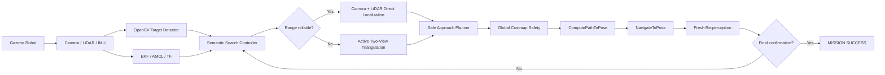

# Semantic Robot

基于 **ROS 2 Jazzy + Gazebo Harmonic + Nav2 + OpenCV** 的移动机器人语义目标搜索、定位与自主接近系统。

项目完成了一条完整的任务闭环：

```text
Search
→ Detect
→ Localize
→ Plan
→ Navigate
→ Re-perceive
→ Re-localize
→ Re-plan
→ Approach
→ Confirm
```

当前 v1.0 已在 Gazebo 中完成端到端回归验证。

---

## Demo Result

一次最新完整回归：

```text
[FINAL CONFIRMATION]
    bottle detected
    angle=8.01 deg
    distance=0.78 m
    range_uncertain=True

[MISSION SUCCESS]
    target reached and visually confirmed
    final_distance=0.78 m
    final_angle=8.01 deg
    range_uncertain=True
    approach_iterations=2
```

即使近距离 LiDAR range 被标记为 uncertain，只要 fresh visual detection 满足最终距离与角度约束，系统仍可完成最终确认。

---

## System Overview


```mermaid
flowchart LR
    A[Gazebo Robot] --> B[Camera / LiDAR / IMU]
    B --> C[OpenCV Target Detector]
    B --> D[EKF / AMCL / TF]
    C --> E[Semantic Search Controller]
    D --> E
    E --> F{Range reliable?}
    F -->|Yes| G[Camera + LiDAR Direct Localization]
    F -->|No| H[Active Two-View Triangulation]
    G --> I[Safe Approach Planner]
    H --> I
    I --> J[Global Costmap Safety]
    J --> K[ComputePathToPose]
    K --> L[NavigateToPose]
    L --> M[Fresh Re-perception]
    M --> N{Final confirmation?}
    N -->|No| E
    N -->|Yes| O[MISSION SUCCESS]
```

---

## Core Capabilities

### 1. Active Semantic Search

机器人在 `SEARCHING` 状态下原地低速旋转扫描：

```text
angular.z = 0.30 rad/s
```

检测到目标后立即停止，并进入后续定位流程。当前 v1.0 采用局部旋转搜索，而不是全地图 waypoint patrol。

### 2. Camera-LiDAR Target Localization

视觉节点通过 OpenCV HSV 分割检测红色目标，并根据 CameraInfo 计算水平 bearing。

Camera 与 LaserScan 的方向约定相反，因此使用：

```text
lidar_angle = -camera_angle
```

目标方向附近取最多 5 个有效 LaserScan sample，并使用 median 抑制单点噪声。

当 LiDAR range 可靠时：

```text
Camera bearing + LiDAR range
→ direct target localization
```

### 3. Active Triangulation Fallback

当：

```text
range_uncertain = True
```

系统不会把不可靠的 LiDAR range 直接当作目标距离，而是：

```text
Observation A
→ plan lateral viewpoint
→ ComputePathToPose validation
→ NavigateToPose
→ Observation B
→ two-ray triangulation
```

短基线三角定位在 `odom` frame 中完成，再将结果一次性转换到 `map`，减少 AMCL 的 `map -> odom` 动态修正对局部几何的影响。

### 4. Costmap-Safe Approach Planning

系统不会直接导航到目标坐标，而是从机器人当前位置生成多个接近候选：

```text
forward distance × angular offset
```

每个候选依次经过：

```text
local costmap safety
→ clearance check
→ remaining distance check
→ ComputePathToPose
→ planned-path cost validation
```

仅对通过验证的候选发送 `NavigateToPose`。

### 5. Closed-Loop Iterative Approach

机器人不会依赖一次粗定位直接走到底，而是：

```text
navigate
→ fresh perception
→ re-localize
→ re-plan
→ navigate again
```

最终确认条件为：

```text
fresh target detection
AND valid distance
AND distance <= final_standoff_distance
AND |camera angle| <= 15°
```

v1.0 默认：

```text
final_standoff_distance = 1.2 m
max_approach_iterations = 3
```

---

## Technology Stack

| Layer | Technology |
| --- | --- |
| OS | Ubuntu 24.04 |
| Middleware | ROS 2 Jazzy |
| Simulation | Gazebo Harmonic |
| Robot Model | URDF / Xacro |
| Transform | TF2 |
| State Estimation | Wheel Odometry + IMU + robot_localization EKF |
| Mapping | SLAM Toolbox |
| Localization | AMCL |
| Navigation | Nav2 |
| Global Planner | Navfn |
| Local Controller | Regulated Pure Pursuit |
| Perception | OpenCV + HSV |
| Sensor Fusion | Camera bearing + 2D LaserScan |
| Mission Logic | Python / rclpy |
| Simulation Bridge | ros_gz_bridge |

---

## Repository Structure

```text
semantic-robot/
├── README.md
├── docs/
│   └── technical_details.md
└── src/
    ├── robot_control/
    │   └── robot_control/
    │       ├── bottle_detector.py
    │       ├── semantic_search_controller.py
    │       ├── slam_explorer.py
    │       ├── waypoint_follower.py
    │       └── ...
    │
    └── robot_description/
        ├── launch/
        │   ├── semantic_robot.launch.py
        │   ├── simulation.launch.py
        │   └── nav2.launch.py
        ├── config/
        │   ├── semantic_mission.yaml
        │   ├── nav2_params.yaml
        │   └── ekf.yaml
        ├── maps/
        ├── urdf/
        └── worlds/
```

---

## Quick Start

### Environment

```text
Ubuntu 24.04
ROS 2 Jazzy
Gazebo Harmonic
Nav2
robot_localization
ros_gz
OpenCV / cv_bridge
```

### Build

```bash
cd ~/semantic_robot_ws

source /opt/ros/jazzy/setup.bash

colcon build --symlink-install

source install/setup.bash
```

### Run

完整系统现在只需要一个 launch：

```bash
ros2 launch robot_description semantic_robot.launch.py
```

统一启动：

```text
Gazebo / robot / bridges
        ↓
EKF + perception
        ↓
Nav2
        ↓
semantic mission controller
```

项目开发环境使用 VMware，因此 `vmware_mode` 默认开启软件渲染相关设置。

非 VMware 环境：

```bash
ros2 launch robot_description semantic_robot.launch.py vmware_mode:=false
```

---

## Configuration

任务与视觉参数集中在：

```text
src/robot_description/config/semantic_mission.yaml
```

包括：

```text
search speed / timeout
HSV threshold
LiDAR association window
range uncertainty threshold
triangulation viewpoint parameters
costmap safety thresholds
approach candidate distances / angles
final standoff distance
max approach iterations
```

Nav2：

```text
src/robot_description/config/nav2_params.yaml
```

EKF：

```text
src/robot_description/config/ekf.yaml
```

---

## State / Mission Flow

主要任务状态包括：

```text
SEARCHING
TARGET_FOUND
REPOSITION_REQUIRED
TARGET_CLEAR
MOVING_TO_OBSERVATION
MOVING_TO_OBSERVATION_B
WAITING_FOR_OBSERVATION_B
NAVIGATING_TO_APPROACH
APPROACH_REACHED
FINAL_CONFIRMATION
```

其中 v1.0 的主要定位路径为：

```text
Reliable LiDAR range
    → direct localization

Uncertain LiDAR range
    → active triangulation fallback
```

---

## Key Engineering Debugging Case

项目中最关键的一次系统级问题来自**机器人物理模型，而不是 Nav2 参数**。

原始机器人长期保持：

```text
pitch ≈ 11.78°
```

导致前置 LiDAR 向下扫描地面，在约：

```text
0.7 m
```

处产生虚假近距离 return，进一步造成：

```text
false SLAM obstacles
→ inflated costmap
→ approach candidate rejection
```

根因是前置 Camera + LiDAR 使整体质心越过支撑边界。

将 8 kg 主底盘 COM 后移：

```xml
<origin xyz="-0.05 0 0" rpy="0 0 0"/>
```

之后：

```text
pitch ≈ 0
front LiDAR range ≈ 5 m
false map obstacles removed
safe approach planning recovered
MISSION SUCCESS
```

这个问题体现了完整机器人链路中的误差传播：

```text
Physical Model
→ Sensor Geometry
→ Perception
→ Mapping
→ Localization
→ Planning
```

---

## Known Limitations

v1.0 已完成端到端任务闭环，但仍有明确边界：

- **Red target only**：当前使用 HSV 红色分割，不是通用目标检测。
- **Range reliability is heuristic**：`range_uncertain` 当前仍主要依据 `distance < 1.0 m`。
- **Local search only**：SEARCHING 当前是原地旋转，不是全地图巡航搜索。
- **2D fusion**：当前使用 Camera horizontal bearing + 2D LaserScan，没有 depth / PointCloud2 / 3D object pose。
- **Monolithic mission controller**：核心状态机仍集中在 `semantic_search_controller.py`，v1.0 为保证已验证主链稳定暂不拆分。
- **No automated integration test yet**：当前通过 Gazebo 完整 mission 做回归验证。

---

## Documentation

完整的机器人模型、TF、EKF、SLAM、Nav2、视觉融合、主动三角定位、approach planner、调试案例与设计决策见：

[docs/technical_details.md](docs/technical_details.md)

---

## Future Work

后续版本优先考虑：

```text
YOLO / multi-class detection
Nav2 waypoint patrol
better Camera-LiDAR association
depth / PointCloud2 / 3D perception
automated regression test
controller modularization
VLM / semantic instruction
```

这些属于 v2+ 扩展，不是当前 v1.0 闭环的必要组成。

---

## Version

```text
v1.0
End-to-End Semantic Search & Approach Pipeline Completed
```

当前核心功能已冻结，后续修改优先围绕工程化、测试、展示与扩展版本展开。

---

## License

ROS package metadata 当前统一声明：

```text
Apache-2.0
```
